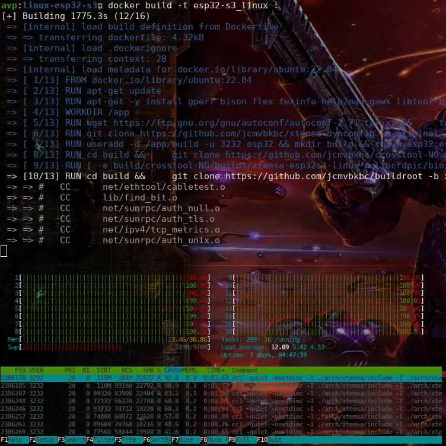

# ESP32 S3 Linux - Docker builder 

Dockerfile ported by Adafruit from the work of [@jcmvbkbc](https://gist.github.com/jcmvbkbc/316e6da728021c8ff670a24e674a35e6)

## Build

Please follow the next steps. 

1. Build the docker image:

```bash
docker build -t esp32-s3_linux .
```

This step takes around ~35 minutes and needs ~20Gb



2. Run a container in a terminal

```bash
docker run --name esp32s3build -it esp32-s3_linux
```

3. In a second termintal, copy the binaries

```bash
docker cp esp32s3build:/app/build/release/ bin_files
```

4. Stop the container

```bash
docker stop esp32s3build 
```

5. Upload

```bash
python esptool.py --chip esp32s3 -p YOUR-PORT-HERE -b 921600 --before=default_reset --after=hard_reset write_flash 0x0 bootloader.bin 0x10000 network_adapter.bin 0x8000 partition-table.bin
```

```bash
parttool.py write_partition --partition-name linux --input xipImage
```

```bash
parttool.py write_partition --partition-name rootfs --input rootfs.cramfs
```

Alternative following this [Adafruit guide](https://learn.adafruit.com/docker-esp32-s3-linux/docker-esp32-s3-linux-image).

# Linux boot


Video:  
